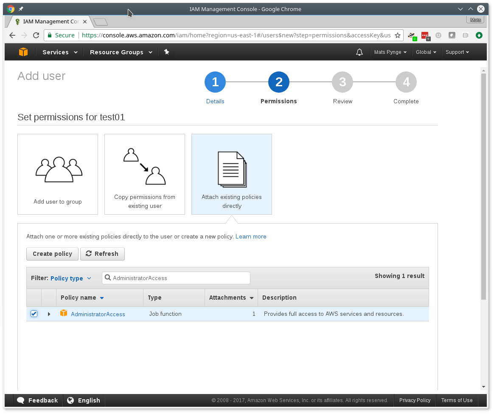
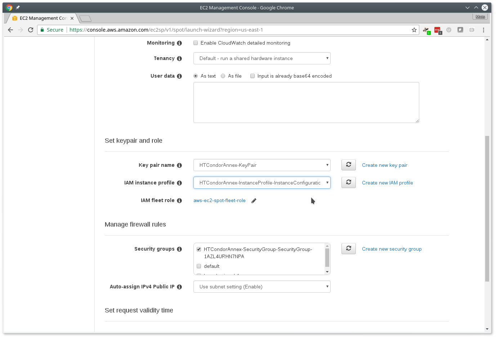
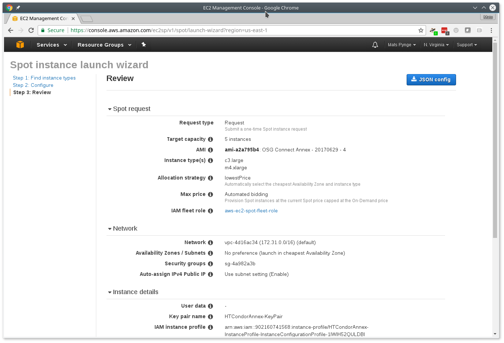
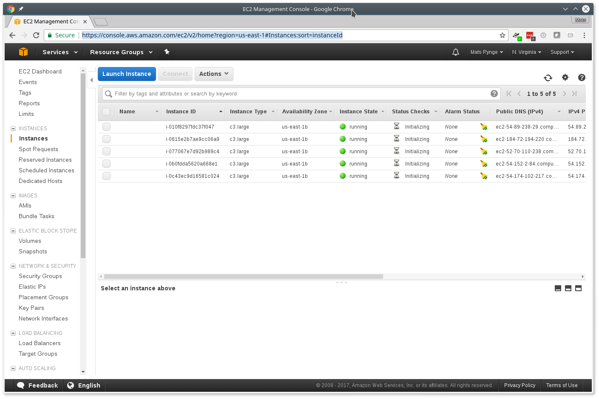

<!-- 

#### Objectives
*   Discover how to use `condor_annex` to add dedicated resources from Amazon AWS
*   Submit workloads to AWS, and to OSG and AWS simultaneously
*   Please note that his is a technical preview. We expect features and interface to change rapidly.

 -->

## condor_annex

`condor_annex` is a HTCondor tool that allows you to add cloud resources, such as Amazon Web Services (AWS), to their "pool" of resources. Please note:

* The `condor_annex` tool is available in the HTCondor 8.7.2 development release
* Labeled as “experimental” because the interface(s) might change
* The current version has limited functionality and hence limited applicability

Use cases

* Deadlines
* Capability - large memory, GPU, long run times, fast local storage, job policies
* Capacity

`connect_annex` is a wrapper around `condor_annex` which provides some OSG Connect integration. Please use `connect_annex` in this tutorial.

## Setting up AWS access

It is assumed at this point that you already have your AWS account setup and verified. Now it is time to create an AWS user, and provide the credentials of that users to `condor_annex`. Start by creating the destination files for the credentials:

    $ mkdir -p ~/.condor
    $ cd ~/.condor
    $ touch publicKeyFile privateKeyFile
    $ chmod 600 publicKeyFile privateKeyFile

The last command ensures that only you can read or write to those files.

To generate and donwload a new pair of security tokens for `condor_annex` to use, go to the [IAM console](https://console.aws.amazon.com/iam/home?region=us-east-1#/home); log in if you need to. The following instructions assume you are logged in as a user with the privilege to create new users. (The 'root' user for any account has this privilege; other accounts may as well.)

 1. Click the __Add User__ button.
 2. Enter name in the User name box; __annex-user__ is a fine choice.
 3. Click the check box labelled __Programmatic access__.
 4. Click the button labelled __Next: Permissions__.
 5. Select __Attach existing policies directly__.
 6. Type __AdministratorAccess__ in the box labelled "Filter".
 7. Click the check box on the single line that will appear below (labelled __AdministratorAccess__)

 8. Click the __Next: review__ button (you may need to scroll down).
 9. Click the __Create user__ button.
 10. From the line labelled annex-user, copy the value in the column labelled __Access key ID__ to `publicKeyFile`.
 11. On the line labelled annex-user", click the __Show__ link in the column labelled __Secret access key__; copy the revealed value to `privateKeyFile`.
 12. Hit the __Close__ button.

The 'annex-user' now has full privileges to your account. We're working on creating a CloudFormation template that will create a user with only the privileges `condor_annex` actually needs.

## Running the Setup Command

The following command will setup your AWS account. It will create a number of persistent components, none of which will cost you anything to keep around. These components can take quite some time to create; `condor_annex` checks each for completion every ten seconds and prints an additional dot (past the first three) when it does so, to let you know that everything's still working.

    $ connect_annex -setup
    Creating configuration bucket (this takes less than a minute)....... complete.
    Creating Lambda functions (this takes about a minute)........ complete.
    Creating instance profile (this takes about two minutes)................... complete.
    Creating security group (this takes less than a minute)..... complete.
    Setup successful.

## Verifying the Setup

You can verify at this point (or any later time) that the setup procedure completed successfully by running the following command.

    $ connect_annex -check-setup
    Checking for configuration bucket... OK.
    Checking for Lambda functions... OK.
    Checking for instance profile... OK.
    Checking for security group... OK.
    Your setup looks OK.

## Our first annex

    $ connect_annex -count 1 \
                    -annex-name MyFirstAnnex$USER \
                    -duration 0.83 \
                    -idle 0.25 \
                    -aws-on-demand-ami-id ami-a2a795b4

This should start the process of bringing one VM up. *Duration*, which is the max lifetime of the VM, is set to 50 minutes. This lifetime is intended to help you conserve money by preventing the annex instances from accidentally running forever. *Idle* is set to 15 minutes, which is the amount of time the VM can sit without any jobs running before terminating.

The specified image (AMI), is a pre-defined OSG Connect image, containing a basic OSG software stack. You can make custom images if you want to.

After a few minutes, we should be able to see the new resource show up in or HTCondor pool:

    $ condor_status -annex MyFirstAnnex$USER

## Running jobs exclusively on AWS instances

Download the annex tutorial:

	$ tutorial annex
	$ cd tutorial-annex

Inside the tutorial directory you will find a sample executable:

	#!/bin/bash
	# short.sh: a short discovery job
	printf "Start time: "; /bin/date
	printf "Job is running on node: "; /bin/hostname
	printf "Job running as user: "; /usr/bin/id
	printf "Job is running in directory: "; /bin/pwd
	echo
	echo "Working hard..."
	sleep 20
	echo "Science complete!"

The first job we will look at is `aws-exclusive.submit`. Pay special attention to the *Requirements* and the *+MayUseAWS* attributes. The former locks the job to only run on AWS resources by matching part of the hostname, and the latter tells annex VMs that this job has been white-listed to run on AWS.

    Universe = vanilla
    
    # Job requirements (OS, cores, memory, ...)
    #Requirements = OSGVO_OS_STRING == "RHEL 6" && Arch == "X86_64" &&  HAS_MODULES == True
    Requirements = regexp("ec2.internal", Machine)
    request_cpus = 1
    request_memory = 1 GB
    request_disk = 1 GB
    
    # By default, AWS resources only runs jobs flagged that they are
    # allowed to run on AWS
    +MayUseAWS = True
    
    # EXECUTABLE is the program your job will run It's often useful
    # to create a shell script to "wrap" your actual work.
    Executable = short.sh
    Arguments = 
    
    # ERROR and OUTPUT are the error and output channels from your job
    # that HTCondor returns from the remote host.
    Error = job.$(Cluster).$(Process).error
    Output = job.$(Cluster).$(Process).output
    
    # The LOG file is where HTCondor places information about your
    # job's status, success, and resource consumption.
    Log = job.log
    
    # Send the job to Held state on failure. 
    on_exit_hold = (ExitBySignal == True) || (ExitCode != 0)
    
    # Periodically retry the jobs every 1 hour, up to a maximum of 5 retries.
    periodic_release =  (NumJobStarts < 5) && ((CurrentTime - EnteredCurrentStatus) > 60*60)
    
    # QUEUE is the "start button" - it launches any jobs that have been
    # specified thus far.
    Queue 1

Submit the job using `condor_submit`:

	$ condor_submit aws-exclusive.submit
	Submitting job(s). 
	1 job(s) submitted to cluster 823.

Use your newly aquired `condor_q` skills to make sure the job runs and finishes.
Then check the .out file. You should see something like:

    Start time: Fri Jun 30 20:59:26 UTC 2017
    Job is running on node: ip-172-31-27-108.ec2.internal
    Job running as user: uid=99(nobody) gid=99(nobody) groups=99(nobody)
    Job is running in directory: /scratch/condor/encrypted0/dir_2313
    
    Working hard...
    Science complete!

Notice how the job directory is encrypted. This is a nice new feature in HTCondor
which makes sense on cloud resources.  From the
[HTCondor 8.7 manual](https://research.cs.wisc.edu/htcondor/manual/v8.7/3_5Configuration_Macros.html#SECTION00458000000000000000)

> ENCRYPT_EXECUTE_DIRECTORY
> 
> A boolean value that, when True, causes the execute directory for jobs
> on Linux or Windows platforms to be encrypted. Defaults to False. Note
> that even if False, the user can require encryption of the execute
> directory on a per-job basis by setting encrypt_execute_directory to
> True in the job submit description file. Enabling this functionality
> requires that the HTCondor service is run as user root on Linux
> platforms, or as a system service on Windows platforms. On Linux
> platforms, the encryption method is ecryptfs, and therefore requires an
> installation of the ecryptfs-utils package. On Windows platforms, the
> encryption method is the EFS (Encrypted File System) feature of NTFS.

### Jobs across OSG and AWS

If we want to run job on both OSG and AWS at the same time, we just need to adjust 
the job `requirements`. Take a look at `aws-and-osg.submit`. The `requirements`
section is:

    # Job requirements (OS, cores, memory, ...)
    # When running on both AWS and OSG, make sure you have a requirements
    # line matching both resources. If you are using the supplied AMI,
    # OSGVO_OS_STRING == "RHEL 6" && Arch == "X86_64" should be sufficient,
    # or you can just always match on AWS resources separately.
    # Examples:
    #
    #    OSGVO_OS_STRING == "RHEL 6" && Arch == "X86_64"
    #
    #    regexp("ec2.internal", Machine) || (OSGVO_OS_STRING == "RHEL 6" && Arch == "X86_64")
    #
    Requirements = regexp("ec2.internal", Machine) || (OSGVO_OS_STRING == "RHEL 6" && Arch == "X86_64")

Make sure you still have at least one annex host active, and then submit the `aws-and-osg.submit` jobs. 

    $ condor_submit aws-and-osg.submit

### Where did jobs run? 

When we start submitting many simultaneous jobs into the queue, it might be worth looking at where they run. To get that information, we'll use the `condor_history` command from quickstart tutorial.Change the job id (942) to the job id provided by the `condor_submit` command:

	$ condor_history -format '%s\n' LastRemoteHost 942 | cut -d@ -f2 | cut -d. -f2,3 | distribution --height=100
	Val          |Ct (Pct)     Histogram
	ec2.internal |456 (46.77%) +++++++++++++++++++++++++++++++++++++++++++++++++++++
	uchicago.edu |422 (43.28%) +++++++++++++++++++++++++++++++++++++++++++++++++
	local        |28 (2.87%)   ++++
	t2.ucsd      |23 (2.36%)   +++
	phys.uconn   |12 (1.23%)   ++
	tusker.hcc   |10 (1.03%)   ++
	...

The distribution program reduces a list of hostnames to a set of hostnames with no duplication (much like `sort | uniq -c`), but
additionally plots a distribution histogram on your terminal window. This is nice for seeing how Condor selected your execution endpoints.

## Stop an Annex

The following command shuts HTCondor off on each instance in the annex; if you're using the default annex image, doing so causes each instance to shut itself down.

    $ condor_off -annex MyFirstAnnex$USER
    Sent "Kill-Daemon" command for "master" to master ip-172-31-48-84.ec2.internal

## Spot Fleet

condor_annex supports Spot instances via an AWS technology called 
*Spot Fleet*. Normally, when you request instances, you request a specific
type of instance (the default on-demand instance is, for instance,
`m4.large`.) However, in many cases, you don't care too much about
how many cores an intance has - HTCondor will automatically advertise
the right number and schedule jobs appropriately, so why would you?
In such cases - or in other cases where your jobs will run acceptably
on more than one type of instance - you can make a Spot Fleet request
which says something like "give me a thousand cores as cheaply as
possible", and specify that an `m4.large` instance has two cores, while
`m4.xlarge` has four, and so on. AWS will then divide the current price
for each instance type by its core count and request spot instances at
the cheapest per-core rate until the number of cores (not the number of
instances!) has reached a thousand, or that instance type is exhausted,
at which point it will request the next-cheapest instance type.

In order to create an annex via a Spot Fleet, you'll need a file
containing a JSON blob which describes the Spot Fleet request you'd like
to make. (It's too complicated for a reasonable command-line interface.)
The AWS web console can be used to create such a file; the button to
download that file is (currently) in the upper-right corner of the last
page before you submit the Spot Fleet request; it is labeled `JSON
config'. You may need to create an IAM role the first time you make a
Spot Fleet request; please do so before running condor_annex.

Additionally, be aware that condor_annex uses the Spot Fleet API in its
`request` mode, which means that an annex created with Spot Fleet has
the same semantics with respect to replacement as it would otherwise: if
an instance terminates for any reason, including AWS taking it away to
give to someone else, it is not replaced.

You must select the instance role profile used by your on-demand
instances for condor_annex to work. This value will be stored in the
configuration macro ANNEX_DEFAULT_ODI_INSTANCE_PROFILE_ARN by the setup
procedure.

    $ grep ANNEX_DEFAULT_ODI_INSTANCE_PROFILE_ARN ~/.condor/user_config
    ANNEX_DEFAULT_ODI_INSTANCE_PROFILE_ARN = arn:aws:iam:...

Go to [AWS Request Spot Instances](https://console.aws.amazon.com/ec2sp/v1/spot/home?region=us-east-1#)
to get started. Click `Request Spot Instances`.

Set target capacity to 5, and use `ami-a2a795b4` for the image.

Select instance types: `c3.large` and `m4.xlarge`

Make sure you select the correct instance role in the dropdown.

Download the JSON file from the upper right corner. Do _not_ finish the guide.

Copy the json file to `~/.condor/fleet.json` under your account on training.osgconnect.net.

    $ connect_annex -annex-name SpotAnnex$USER \
                    -slots 5 \
                    -aws-spot-fleet-config-file ~/.condor/fleet.json 
    Will request 5 spot slots for 0.83 hours.  Each instance will terminate after being idle for 0.25 hours.
    Is that OK?  (Type 'yes' or 'no'): yes
    Starting annex...
    Annex started. It will take about six minutes for the new machines to join the pool.

If you go back to your [AWS EC2 Instances console](https://console.aws.amazon.com/ec2/v2/home?region=us-east-1#Instances:sort=instanceId)
you will find the spot instances starting up.

As in the on-demand case, we can check on the instances with `condor_status -annex`

    $ condor_status -annex SpotAnnex$USER
    Name                                OpSys      Arch   State     Activity LoadAv Mem   ActvtyTime
    
    slot1@ip-172-31-80-9.ec2.internal   LINUX      X86_64 Unclaimed Idle      0.000 1820  0+00:00:23
    slot2@ip-172-31-80-9.ec2.internal   LINUX      X86_64 Unclaimed Idle      0.000 1820  0+00:00:30
    slot1@ip-172-31-82-119.ec2.internal LINUX      X86_64 Unclaimed Idle      0.000 1820  0+00:00:16
    slot2@ip-172-31-82-119.ec2.internal LINUX      X86_64 Unclaimed Idle      0.000 1820  0+00:00:22
    slot1@ip-172-31-86-220.ec2.internal LINUX      X86_64 Unclaimed Idle      0.000 1820  0+00:00:23
    slot2@ip-172-31-86-220.ec2.internal LINUX      X86_64 Unclaimed Idle      0.000 1820  0+00:00:29
    
                         Machines Owner Claimed Unclaimed Matched Preempting  Drain
    
            X86_64/LINUX        6    0       0         6       0          0      0
    
                   Total        6    0       0         6       0          0      0

